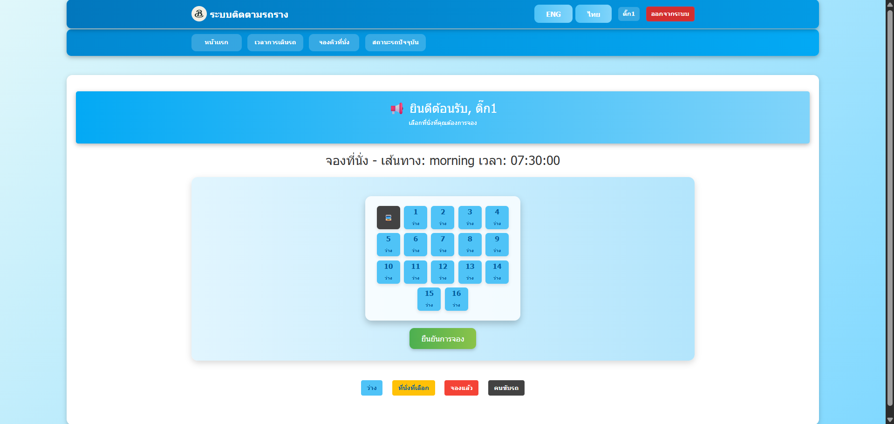

# 🚌 Bus Tracking System (Data-Driven Application)

## 📌 Overview
This project is a data-driven bus tracking system that integrates real-time GPS data with user activity to monitor bus routes, estimate arrival times (ETA), and analyze system usage.

The system transforms raw location and user data into actionable insights to support transportation planning and decision-making.

---

## 🎯 Objective
- Analyze real-time GPS and user data to improve transportation efficiency  
- Identify peak usage periods and user behavior patterns  
- Estimate arrival times (ETA) using GPS data  
- Support data-driven decision-making through dashboards  

---

## 📊 Data Analysis & Insights
- Identified peak usage periods based on user activity  
- Analyzed trip frequency and demand patterns  
- Estimated arrival times using GPS-based calculations  
- Improved system visibility using dashboards  

---

## 🛠️ Tech Stack
- **Database:** PostgreSQL  
- **Backend:** PHP (RESTful APIs)  
- **Frontend:** HTML, CSS, JavaScript  
- **Data Visualization:** Power BI  
- **Other:** GPS Data, Google Maps API  

---

## 📊 Key Features
- 📍 Real-time GPS tracking  
- ⏱️ ETA (Estimated Time of Arrival) prediction  
- 👥 User behavior analysis  
- 📊 Dashboard for monitoring system usage  
- 💺 Seat reservation system  

---

## 🖼️ System Screenshots

### 📍 Bus Tracking

### 📊 Dashboard

### 💺 Seat Reservation

---

## 📂 Project Structure
